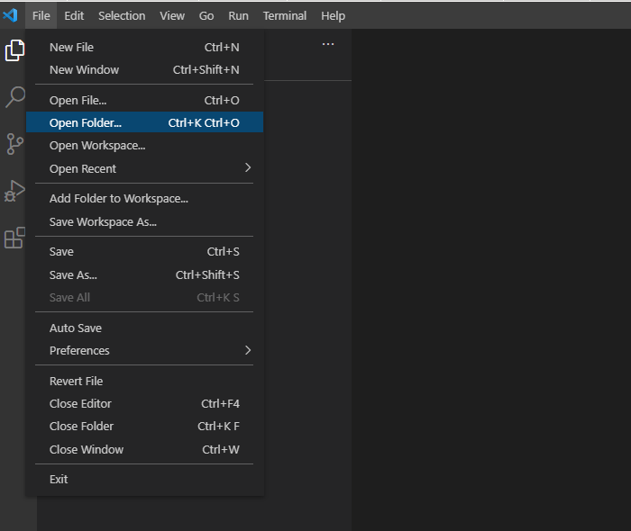

 
INSTRUCCIONS PER FER FUNCIONAR EL SERVIDOR.

1º: Instalar les dependècies del projecte. Per fer això, obrim la terminal i escribim "npm install".
2º: Arrancar el servidor, escribint per la terminal: "node app.js", previuament ens hem de situar a la carpeta adecuada:
cd "Entrega 4.1"
cd app
node app.js

  Llista d'EndPoints:

     "/user": "GET -> retorna un JSON amb el teu nom, edat i l'URL des d'on es fa la petició.",
     
     "/upload": "POST -> puja al servidor un arxiu de tipus png/jpg/gif amb una petició POST i que retorni un missatge d'error en cas que l'extensió de l'arxiu no coincideixi amb aquestes.",
     
     "/time": "POST -> rep per POST com a paràmetre un JSON amb el nom d'usuari i retorna un objecte JSON que conté l'hora i data actual. Inclou un middleware que afegeix la capçalera Cache-control: no-cache. Habilita CORS en les respostes mitjançant Express"
     
     "/pokemon": "GET -> retorna un JSON amb el nom del Pokémon, alçada i pes, en la API Pokémon, segons el ID que l'hem passat.

Per provar els endpoints, obrim l'aplicación POSTMAN. I executem:

GET  -> http://localhost:3000/user
POST -> http://localhost:3000/upload      
POST -> http://localhost:3000/time   


# Node Initial Project

### Project Structure

Main structure of node.js project. Folders / files:

- <b>\_\_tests__</b>. Tests folder. See [Jest Docs](https://jestjs.io/es-ES/docs/configuration) and [Chai Docs](https://www.chaijs.com/)
- <b>app</b>:
    - <b>config</b>
    - <b>controllers</b>
    - <b>middlewares</b>
    - <b>models</b>
    - <b>routes</b>
    - <b>helpers</b>
    - <b>app.js</b>. Entry point.
- <b>package.json</b>.
- <b>.env</b>. Environment descriptor. See [dotenv doc](https://www.npmjs.com/package/dotenv).

Extras:
- <b>.eslintrc</b>. Linter JS, static code analyzer. See [EsLint Docs](https://eslint.org/docs/user-guide/configuring/configuration-files).
- <b>.prettierignore</b>. Code formatter. See [Prettier Config](https://prettier.io/docs/en/configuration.html) and [Prettier Ignore](https://prettier.io/docs/en/ignore.html).
- <b>.ecosystem.config.js</b>. Process Manage at runtime. See [PM2 Docs](https://pm2.keymetrics.io/).

### Import project for use with Visual Studio Code

Follow the steps below:
* Clone the project from the Github Platform. Execute:
  ```
  git clone [url project]
  ```
* Open the project downloaded.
  


### Import project for use with WebStorm

Follow the steps below:
* Clone the project from the Github Platform. Execute:
  ```
  git clone [url project]
  ```
* Open the project downloaded.


### Utilities

* [Node Developers Guide](https://nodejs.dev/learn)
* **.gitignore file** configuration. See [Official Docs](https://docs.github.com/en/get-started/getting-started-with-git/ignoring-files).
* **Git branches**. See [Official Docs](https://git-scm.com/book/en/v2/Git-Branching-Branches-in-a-Nutshell)
